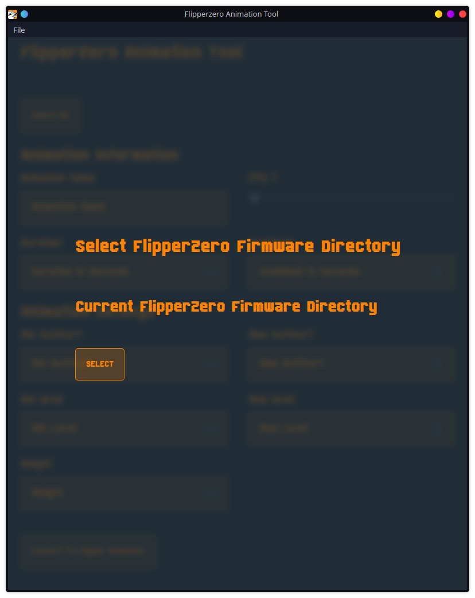
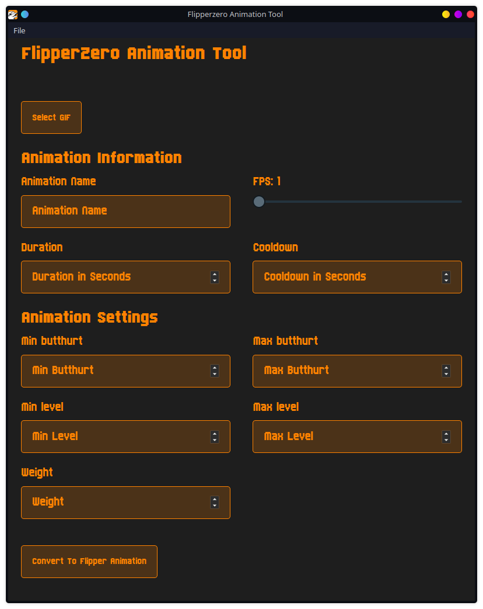

# FlipperZero Animation Tool

An application to turn animated GIFs into FlipperZero animation data.

## Instructions

1. Go to [FlipperZero Firmware GitHub Repo](https://github.com/flipperdevices/flipperzero-firmware)
2. Clone the repository
3. Run the fbt file in the repository
4. Install [GraphicsMagick](http://www.graphicsmagick.org/)
5. Open FlipperZero Animation Tool
6. On the FlipperZero Firmware Directory screen click the Select FlipperZero Firmware Button and Select the root of the FlippZero Firmware directory
7. Select a gif you would like to convert to a FlipperZero Animation
8. A live preview of your animation will appear next to the select button
9. Fill out the form below with the GIF information
   1. Good Defaults
      - Name: A unique animation name
      - FPS: 7
      - Duration: 3600
      - Cooldown: 1
      - Min butthurt: 0 `To appear your butthurt must be higher than this number`
      - Max butthurt: 3 `To appear your butthurt must be lower than this number`
      - Min level: 0 `To appear your level must be higher than this number`
      - Max level: 3 `To appear your level must be lower than this number`
      - Weight: 3 `Higher Weight means more priority`
10. Bubble (Optional)
    - Text Box X `X Position of the speech bubble`
    - Text Box Y `Y Position of the speech bubble`
    - Align Horizontal `Horizontal alignment of the speech bubble tick`
    - Align Vertical `Vertical alignment of the speech bubble tick`
    - Start Frame `Frame to begin the speech bubble`
    - End Frame `Frame to end the speech bubble`
    - Bubble Text `Text to appear in the speech bubble`
11. Click the Convert To Flipper Animation button
12. Go to the %flipper-zero-firmware%/assets/resources/dolphin directory
13. Copy your animation folder and the manifest.txt to the /SD Card/dolphin directory

## Requirements

- [GraphicsMagick](http://www.graphicsmagick.org/)
- [FlippZero Firmware](https://github.com/flipperdevices/flipperzero-firmware) repo cloned
